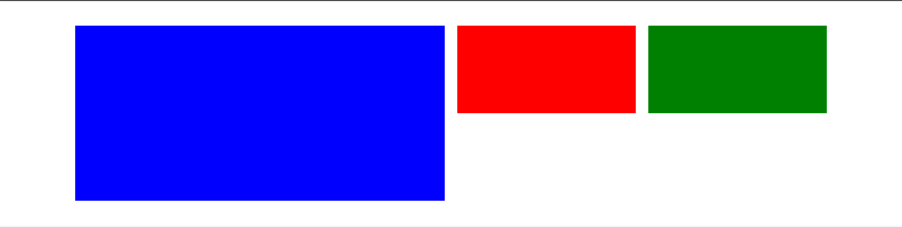

# Components vs Layouts

One concept that can drastically reduce the complexity of your CSS and increase the reusability of your HTML is to separate the concepts of what is part of a "Component" and what is "Layout".

> Layout is like a bookshelf and then components are like the things that get to move around on the bookshelf - Brad Westfall

The point of separating Layout from Components makes it easier to move components around.
For instance consider a single Tweet on Twitter.
This would be a component, both on desktop:


And on mobile:


But notice that even when this tweet is shown on mobile and takes up the full-width of the page, it's rendering is the same!
This is the definition of a good Component, even as the layout changes it can adapt and fill the space needed.
It is also independent of the grid (or lack of grid) that may contain it.

This also makes reusability of layout primitives easier when they do not carry the baggage of styling like `borders`, `box-shadows`, `background`, or text properties.

Consider the following layout:



The left side is about half of the page size and then there are two quarter grid items.
At first glance, you might think that the HTML may look like:

```html
<div class="columns">
  <div class="column is-half">
    <div class="blue"></div>
  </div>
  <div class="column is-quarter">
    <div class="red"></div>
  </div>
  <div class="column is-quarter">
    <div class="green"></div>
  </div>
</div>
```

But this actually is a tougher way of breaking down this layout since it limits new content that could be added to the right side of the page.
Instead, let's look at how we can reuse the `columns` primitive to make a fluid and dynamic grid:

```html
<div class="section">
  <div class="container">
    <div class="columns">
      <div class="column is-6">
        <div class="blue"></div>
      </div>
      <div class="column is-6">
        <div class="columns is-multiline right-x">
          <div class="column is-6">
            <div class="red"></div>
          </div>
          <div class="column is-6">
            <div class="green"></div>
          </div>
        </div>
      </div>
    </div>
  </div>
</div>
```

See this example on [Codepen](http://codepen.io/rtablada/pen/oYYNvN)

Notice that by breaking down the left and right into halves and then creating a new row of columns in the right side, there is now room for more items on the right to fit into the grid system.
Try adding a `.column+.orange` to the codepen HTML within the `right-x` div to see this in action!

If the grid items and sizes had borders or any styles not pertaining to layout, then this flexibility would not be possible!

Also as a note, components should not contain layout style elements, so for instance while it may be tempting to use the `column` classes above to recreate the tweet "Component" picture to text ratio, this would add weight and complexity if the layout classes were to change.

---

Let's continue by how we can use the concepts of layout to create a responsive grid and set of containers for a full responsive site: [NEXT](04-grids.md)
