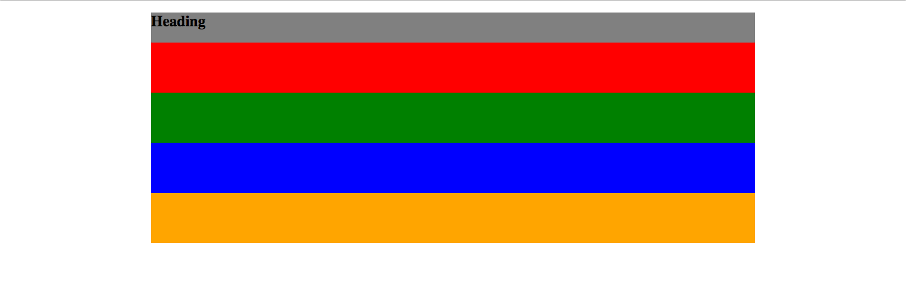
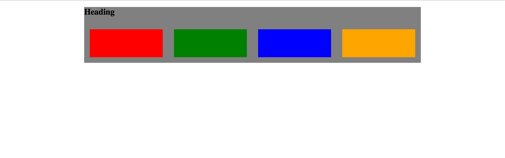
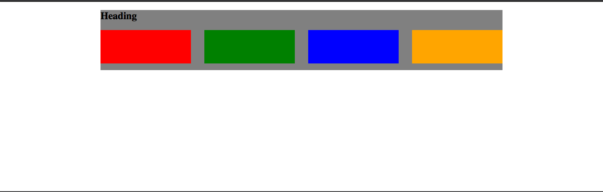
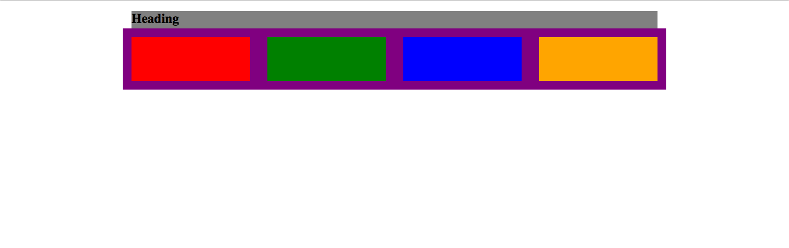
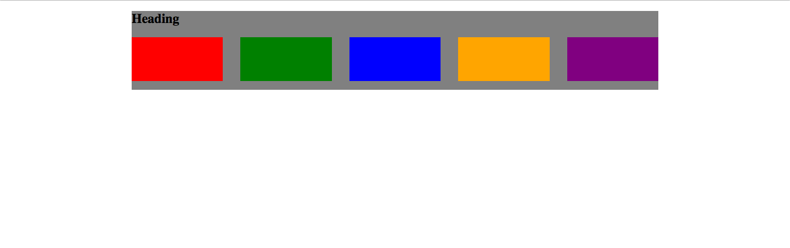
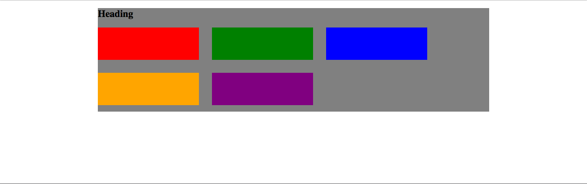
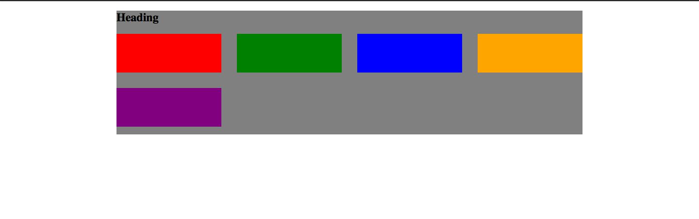
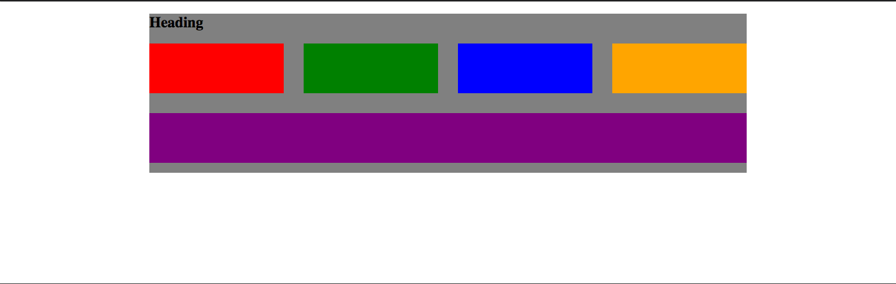
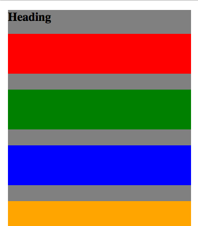

# Grids and Containers

Grids and containers can be rather intimidating when building layout.
With libraries like Bootstrap packing a mind-boggling 1051 lines of code for just a 12 column responsive grid, it's no wonder that companies think that responsive grids are best left to a framework!
Luckily with a few tricks, you'll be making an even better, more responsive, and more maintainable grid than one you'd find off the shelf.

let's start with some basic HTML for our grid.

```html
<div class="grid">
  <div class="grid__item">
    <div class="red"></div>
  </div>
  <div class="grid__item">
    <div class="green"></div>
  </div>
  <div class="grid__item">
    <div class="blue"></div>
  </div>
  <div class="grid__item">
    <div class="orange"></div>
  </div>
</div>
```



Here we're using BEM naming conventions to make it easier to see that `grid__item`s belong directly within `grid` blocks.
We'll also be using SCSS to help see how these items belong together.
This will also help to see how `display: flex` changes child elements.
LET'S GET STARTED!!!

First we need to have our `grid` line up our four `grid__item`s next to each other using flexbox:

```scss
.grid {
  display: flex;
}
```


Next we need our `grid__item` to be 1/4 of the grid width for flexibility later we'll use `flex-basis` instead of `width` (more on this decision later).

```scss
.grid {
  display: flex;

  &__item {
    flex-basis: 25%;
  }
}
```


Now that we have 1/4s we should get whitespace between our `grid__item` elements using margin:

```scss
.grid {
  display: flex;

  &__item {
    flex-basis: 25%;
    margin: 1rem;
  }
}
```



Notice that this did two things:

* Since `flex-shrink` defaults to `1`, the `grid__item`s have shrunk from their last size.
* Since all of the elements have margin on all sides, the red `grid__item` no longer lines up with the heading that isn't part of our grid.

Frameworks often complicate this by requiring all elements to be within grid containers, but this adds a lot of unnecessary weight to our HTML!
Instead, we can get around this with a single line of CSS (oh and no `:nth-of-type` selectors that often complicate grids):

```scss
.grid {
  display: flex;
  margin: -1rem;

  &__item {
    flex-basis: 25%;
    margin: 1rem;
  }
}
```



Here the `-1rem` margin stretches the `grid` div actually beyond the grey background of it's parent element.
This can be seen by quickly giving a purple temporary background to our `grid` div:



But what if we add another element to our HTML:

```html
<div class="grid">
  <div class="grid__item">
    <div class="red"></div>
  </div>
  <div class="grid__item">
    <div class="green"></div>
  </div>
  <div class="grid__item">
    <div class="blue"></div>
  </div>
  <div class="grid__item">
    <div class="orange"></div>
  </div>
  <div class="grid__item">
    <div class="purple"></div>
  </div>
</div>
```



Uh oh!!!
Looks like now we have a 5 element grid even though our `flex-basis` is `25%`?
We can prevent this by adding `flex-wrap` on our `grid`:

```scss
.grid {
  display: flex;
  flex-wrap: wrap;
  margin: -1rem;

  &__item {
    flex-basis: 25%;
    margin: 1rem;
  }
}
```



But now there's only three elements on each row in our `grid`?
If we recall the ["Box Model"](01-box-model.md), even with `box-sizing: border-box` our `width` doesn't account for `margin`s.
So to fix this we can use the `calc` function to subtract the left and right margins on our `grid__item`s:

```scss
.grid {
  display: flex;
  flex-wrap: wrap;
  margin: -1rem;

  &__item {
    flex-basis: calc(25% - 1rem - 1rem);
    margin: 1rem;
  }
}
```



The next step is optional, but in my opinion it makes a really cool grid.
What to do with the `grid__item` that is all by itself.
Here we can leverage flexbox in a few different ways, my personal favorite is to add `flex-grow: 1` to the `grid__item` so that it fills up any remaining space on it's row:

```scss
.grid {
  display: flex;
  flex-wrap: wrap;
  margin: -1rem;

  &__item {
    flex-basis: calc(25% - 1rem - 1rem);
    flex-grow: 1;
    margin: 1rem;
  }
}
```



The last thing we can do is make sure that our grid stacks vertically on mobile using a media query.
For this we can make our `grid` div `flex-direction: column`.
This will make all of the `grid__item`s stack!

```scss
.grid {
  display: flex;
  flex-wrap: wrap;
  margin: -1rem;

  &__item {
    flex-basis: calc(25% - 1rem - 1rem);
    flex-grow: 1;
    margin: 1rem;
  }

  @media (max-width: 400px) {
    flex-direction: column;
  }
}
```



> **NOTE** Notice that this grid doesn't use any `min-width` or `max-width` settings.
> This is because it should be the responsibility of components to decide when they break down.
> If a tweet needs `20rem` width to render properly, then the grid shouldn't add this limitation since it could have a button column that only needs `4rem`.


Here is a [Codepen playground](http://codepen.io/rtablada/pen/ZBBEJP) to work with grids.
